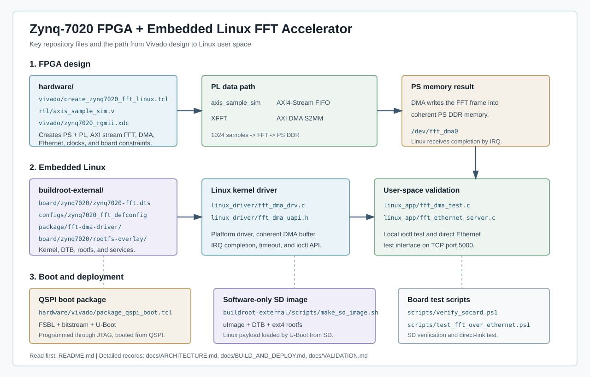
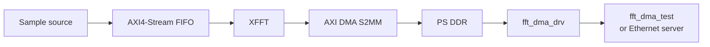

# Zynq-7020 FPGA + Embedded Linux FFT Accelerator

This repository contains the FPGA and Embedded Linux files for a Zynq-7020 FFT
test design. The PL generates a 1024-sample stream, passes it through XFFT, and
writes the result to PS DDR through AXI DMA. Linux starts the transfer through
`/dev/fft_dma0` and waits for the DMA interrupt.

The board boots FSBL, the bitstream, and U-Boot from QSPI. The SD card contains
the kernel, Device Tree, and Buildroot root filesystem.

## Embedded Linux scope

This is a board-support and kernel-integration project, not a user-space DMA
demo. The Linux driver owns the AXI DMA registers and coherent buffer; user
space receives a small ioctl result instead of mapping PL registers or DDR with
`/dev/mem`.

| Area | Evidence in this repository |
| --- | --- |
| Board bring-up | Zynq PS configuration, QSPI boot package, SD Linux image, and direct Ethernet link |
| Kernel integration | Custom Device Tree node, platform driver, misc device, and init-time module loading |
| DMA correctness | 32-bit coherent allocation, IRQ completion, serialized requests, timeout, and error status handling |
| User-space boundary | Shared UAPI header, local ioctl client, and small TCP control endpoint |
| Reproducibility | Buildroot defconfig and external packages, Vivado/Vitis Tcl, SD write verification, and repository checks |

Read [Linux integration](docs/LINUX_INTEGRATION.md) for the Device Tree,
driver, UAPI, and target-validation contracts. Build and deployment commands
are in [Build and deploy](docs/BUILD_AND_DEPLOY.md).

## Main components

| Part | Used here |
| --- | --- |
| SoC | XC7Z020-2CLG484I |
| PL path | Sample source -> AXI4-Stream FIFO -> XFFT -> AXI DMA S2MM |
| Linux | Buildroot, Device Tree, platform DMA driver, shared ioctl UAPI |
| Boot | QSPI for FSBL/bitstream/U-Boot; SD for Linux |
| Host link | Direct Ethernet, TCP port 5000 |

## Project file map



## Data flow



The sample source is `axis_sample_sim`, not an ADC. It produces a deterministic
Q15 frame at a 100 MHz stream clock. XFFT output is bit-reversed, so this test
expects its largest value at bin 1.

## Boot flow

```text
Power on
  -> QSPI BootROM mode
  -> FSBL and PL bitstream from QSPI
  -> U-Boot from QSPI
  -> uImage and DTB from SD FAT partition
  -> rootfs from /dev/mmcblk0p2
```

The SD image is software-only. It does not contain `BOOT.BIN`, an FSBL, a
bitstream, or U-Boot.

## Last board test

The following values came from the board after a QSPI reset and an Ethernet
`RUN` request:

```text
BOOT_MODE: 0x00000001
PC:        0xC0121D28
RESULT status=0x00000002 bytes=4096 peak=1 re=16384 im=0 mag2=268435456
```

`0x00000002` is the AXI DMA idle/completion state. During the earlier JTAG
check, the DMA destination was `0x1F042000`, a runtime coherent DMA address.

## Run the Ethernet test

Use a direct link between the PC USB Ethernet adapter and the board:

```text
PC:    192.168.7.1/24
Board: 192.168.7.2/24
```

```powershell
.\scripts\set_direct_ethernet.ps1 -InterfaceAlias "<USB Ethernet alias>"
.\scripts\test_fft_over_ethernet.ps1
```

## Repository layout

| Path | Contents |
| --- | --- |
| [`hardware/`](hardware) | RTL, Vivado Tcl, constraints, QSPI and JTAG scripts |
| [`linux_driver/`](linux_driver) | AXI DMA platform driver |
| [`include/uapi/`](include/uapi) | Shared ioctl ABI for the driver and user-space clients |
| [`linux_app/`](linux_app) | Local test client and Ethernet server |
| [`buildroot-external/`](buildroot-external) | Buildroot defconfig, packages, DTB, SD image files |
| [`docs/HARDWARE.md`](docs/HARDWARE.md) | Board wiring used by this design |
| [`docs/ARCHITECTURE.md`](docs/ARCHITECTURE.md) | Boot and DMA notes |
| [`docs/VALIDATION.md`](docs/VALIDATION.md) | Board test record |
| [`docs/LINUX_INTEGRATION.md`](docs/LINUX_INTEGRATION.md) | Driver, Device Tree, UAPI, and Buildroot contracts |
| [`docs/BUILD_AND_DEPLOY.md`](docs/BUILD_AND_DEPLOY.md) | Build and programming commands |

## Notes

- `fft_dma_drv` is GPL-2.0-only because it uses GPL-only kernel symbols.
- Vivado, Vitis, and Buildroot outputs are ignored. Rebuild them from the
  scripts in this repository.
- This design has not been tested with a physical ADC or as a long-duration
  acquisition system.
- `./scripts/check_project.sh` verifies host-side source and user-space builds;
  it does not replace the target DMA test.
