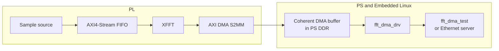

# Zynq-7020 FPGA + Embedded Linux FFT Accelerator

This project runs a PL FFT capture path on a Zynq-7020 board and controls it
from Buildroot Linux. `axis_sample_sim` produces a 1024-sample stream, which
passes through XFFT and AXI DMA S2MM into PS DDR.

The custom Linux driver is a DMAengine client. It requests the Xilinx S2MM
channel, allocates a 4 KiB coherent buffer with the DMAengine device, waits for
the completion callback, and returns the FFT peak through `/dev/fft_dma0`.
User space does not map AXI DMA registers or DDR through `/dev/mem`.

FSBL, the PL bitstream, and U-Boot boot from QSPI. The kernel, DTB, and
Buildroot root filesystem are loaded from SD.

## Linux implementation

- The Device Tree describes a standard Xilinx AXI DMA controller and a separate
  DMAengine client node for the capture GPIO.
- `fft_dma_drv` requests S2MM through DMAengine and handles coherent memory,
  callback completion, request serialization, timeout recovery, and the ioctl.
- `include/uapi/fft_dma_uapi.h` is the shared ABI used by the driver and both
  user-space clients.
- Buildroot builds the module, local test client, and direct Ethernet endpoint
  into the target image.

[Linux integration](docs/LINUX_INTEGRATION.md) documents the Device Tree,
driver, UAPI, and Buildroot interfaces. [DMAengine V2 validation](docs/DMAENGINE_V2_DEBUG.md)
contains the JTAG-first stress-test and debugging procedure. [Build and deploy](docs/BUILD_AND_DEPLOY.md)
contains the build and programming commands.

## Driver evolution

V1 is retained as a readable baseline in
[`linux_driver/v1_register/`](linux_driver/v1_register/). It owned AXI DMA
registers and the S2MM IRQ directly. V2 is the active driver in
[`linux_driver/fft_dma_drv.c`](linux_driver/fft_dma_drv.c): the upstream Xilinx
DMAengine provider owns the controller and interrupt, while the project driver
owns the capture trigger, coherent buffer, result checking, and ioctl ABI.

V1 has a recorded SD-boot smoke test. V2 adds the DMAengine binding, a
JTAG-first test gate, 1,000 and 10,000 transfer stress runs, and the latency /
throughput benchmark. V1 is not built into the V2 image.

## Data path



The sample source is a synthesizable test generator, not an ADC. It sends a
deterministic Q15 frame at a 100 MHz stream clock. XFFT output is bit-reversed,
so this test expects the largest value at bin 1.

## Boot layout

| Storage | Contents |
| --- | --- |
| QSPI | FSBL, PL bitstream, and U-Boot |
| SD FAT partition | `uImage`, `zynq7020-fft.dtb`, and `extlinux.conf` |
| SD ext4 partition | Buildroot root filesystem |

```text
Power on -> QSPI BootROM -> FSBL + bitstream -> U-Boot
         -> kernel + DTB from SD -> rootfs from /dev/mmcblk0p2
```

The SD image is software-only. It does not contain `BOOT.BIN`, an FSBL, a
bitstream, or U-Boot.

## V1 baseline board test

This result was captured before the DMAengine V2 conversion. After a QSPI reset
and SD Linux boot, the PC sent `RUN` to the board over the direct Ethernet link.
The server opened `/dev/fft_dma0` and issued the V1 ioctl.

```text
RESULT status=0x00000002 bytes=4096 peak=1 re=16384 im=0 mag2=268435456
```

`0x00000002` is the V1 AXI DMA idle state after completion. DMAengine V2 passed
the JTAG `BENCH 1000` and `BENCH 10000` tests with zero timeouts and DMA errors;
the detailed latency and throughput record is in
[DMAENGINE_V2_DEBUG.md](docs/DMAENGINE_V2_DEBUG.md). The V1 board record is in
[VALIDATION.md](docs/VALIDATION.md).

## Run the direct Ethernet test

Use a direct link between the PC USB Ethernet adapter and the board. No router,
gateway, or DHCP server is used.

```text
PC:    192.168.7.1/24
Board: 192.168.7.2/24
```

```powershell
.\scripts\set_direct_ethernet.ps1 -InterfaceAlias "<USB Ethernet alias>"
.\scripts\test_dmaengine_stress.ps1
```

## Repository layout

| Path | Contents |
| --- | --- |
| [`hardware/`](hardware) | RTL, Vivado Tcl, constraints, QSPI, and JTAG scripts |
| [`linux_driver/`](linux_driver) | Active DMAengine client and retained V1 direct-register reference |
| [`include/uapi/`](include/uapi) | Shared ioctl ABI |
| [`linux_app/`](linux_app) | Local test client and Ethernet server |
| [`buildroot-external/`](buildroot-external) | Buildroot defconfig, packages, DTB, and SD image files |
| [`docs/HARDWARE.md`](docs/HARDWARE.md) | Board wiring used by this design |
| [`docs/LINUX_INTEGRATION.md`](docs/LINUX_INTEGRATION.md) | Device Tree, driver, UAPI, and Buildroot details |
| [`docs/VALIDATION.md`](docs/VALIDATION.md) | Board test record and test limits |

## Development checks

Run the lightweight source checks from WSL or another Linux host:

```bash
./scripts/check_project.sh
```

This checks shell syntax and builds the user-space clients. It does not replace
the target DMA test. GitHub Actions runs the same check on pushes and pull
requests.

## Limits

- No external ADC has been connected to this design.
- The DMAengine V2 JTAG test covers 10,000 sequential 4 KiB transfers. It does
  not establish multi-hour stability, sustained external-ADC capture, or analog
  signal quality.
- The kernel module is GPL-2.0-only because it uses GPL-only kernel symbols.
