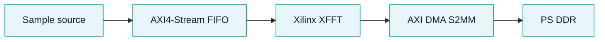

# Zynq-7020 FPGA + Embedded Linux Bring-Up

This repository contains the hardware and software needed to run a small
Zynq-7020 capture system. The board starts Buildroot Linux, brings up Ethernet,
and can reach the Internet. The programmable logic generates a fixed
AXI4-Stream frame; the result is processed by Xilinx XFFT and written to PS DDR
by AXI DMA.

## Network access

Ethernet is part of the normal boot path, not only a debug cable. `eth0` asks
for a DHCP lease at startup. When connected to a router, or to a PC using
Internet Connection Sharing, the board receives its address, default route,
and DNS settings and can reach the Internet.

## Capture data flow



The sample source sends 1024 words per frame. Each word is 32 bits, so one
transfer is 4096 bytes. The lower 16 bits contain the Q15 real value; the upper
16 bits are zero for the imaginary value. There is no external ADC in this
design.

Xilinx XFFT is used unchanged as a stream workload. The project does not claim
custom FFT RTL or a custom FFT algorithm.

## Linux side

Buildroot creates the ARMv7 Linux image for the Zynq PS and includes the kernel
module, user-space applications, and SD card image. The active configuration is
[zynq7020_fft_defconfig](buildroot-external/configs/zynq7020_fft_defconfig).

The kernel module [fft_dma_drv.c](linux_driver/fft_dma_drv.c) is a DMAengine
client. It submits one S2MM transfer, waits for completion, checks the result,
and returns it through `/dev/fft_dma0`. The Xilinx DMAengine provider keeps
ownership of the AXI DMA registers and interrupt.

The Device Tree connects the client to the S2MM channel and also describes the
Ethernet MAC, PHY reset, and Realtek PHY:
[zynq7020-fft.dts](buildroot-external/board/zynq7020/zynq7020-fft.dts).

## Boot and test

QSPI holds the FSBL, PL bitstream, and U-Boot. The SD card contains the Linux
kernel, Device Tree, root filesystem, module, and test applications.

```text
BootROM -> FSBL -> PL bitstream -> U-Boot -> SD Linux
```

JTAG is used first to load the test payload without writing storage. Once the
same payload passes through JTAG, it is written to the SD card and checked
again after normal boot.

Recorded target results:

| Test | Result |
| --- | --- |
| 1,000 transfers | 0 timeout or DMA errors, 205.119 us mean latency, 18.891 MiB/s |
| 10,000 transfers | 0 timeout or DMA errors, 205.413 us mean latency, 18.863 MiB/s |

The throughput is the end-to-end rate for sequential 4096-byte transactions.
It is not AXI DMA peak bandwidth or an ADC sample-rate claim. Debug records
for DMA timeout, IRQ, and Device Tree failures are in
[DMAENGINE_DEBUG.md](docs/DMAENGINE_DEBUG.md).

## Repository contents

| Path | Contents |
| --- | --- |
| [hardware/](hardware) | Vivado Tcl, constraints, JTAG scripts, and PL sources |
| [linux_driver/](linux_driver) | DMAengine client module |
| [linux_app/](linux_app) | Test program and benchmark |
| [include/uapi/](include/uapi) | Shared ioctl ABI and frame constants |
| [buildroot-external/](buildroot-external) | Buildroot packages, DTS, rootfs overlay, and image scripts |
| [docs/](docs) | Build, validation, hardware, and debugging notes |
| [scripts/](scripts) | Build checks and SD card helpers |

## Limits

- The input is a synthetic PL source, not an external ADC.
- Transfers are one frame at a time; there is no cyclic DMA or continuous
  acquisition path.
- The 1000 ms timeout is a recovery watchdog, not a transfer-time target.

Run the local source checks with:

```bash
./scripts/check_project.sh
```

Build and deployment commands are in
[BUILD_AND_DEPLOY.md](docs/BUILD_AND_DEPLOY.md).
